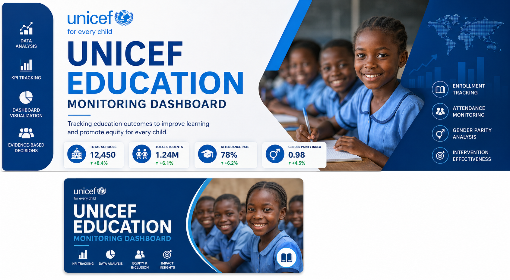
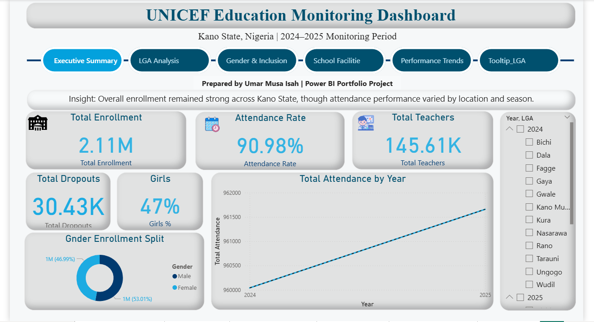
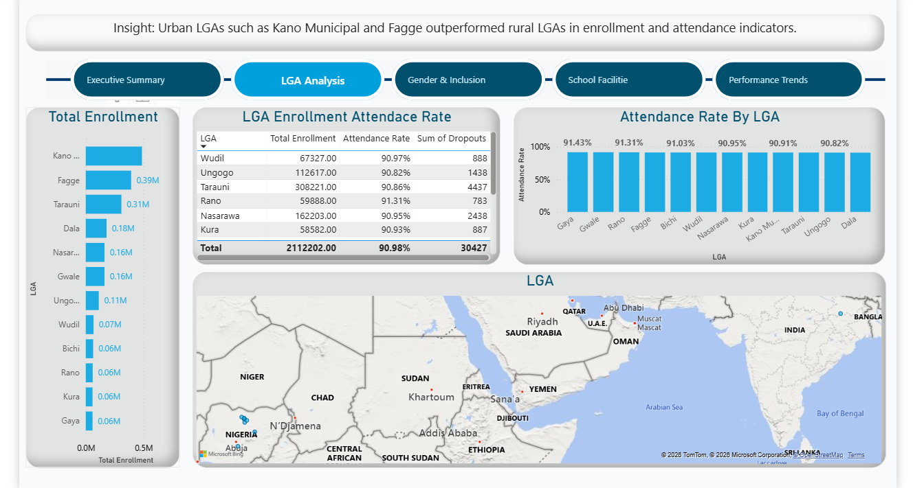
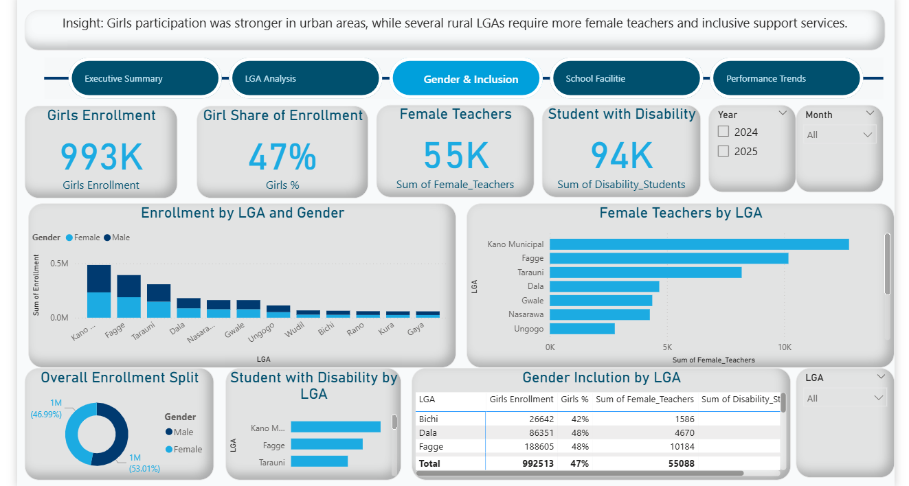
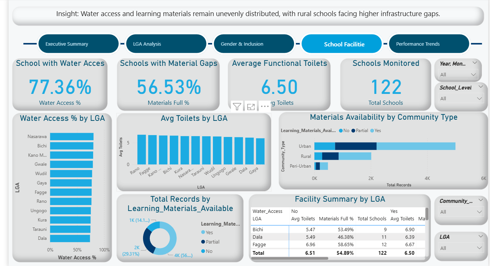
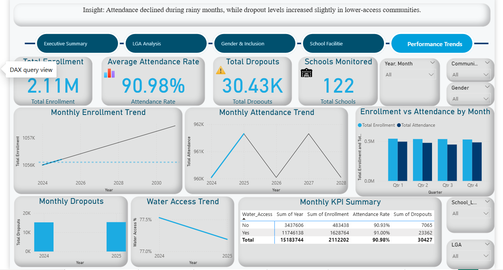

# unicef-education-monitoring-dashboard

# UNICEF Education Monitoring Dashboard


---

## Project Overview

The UNICEF Education Monitoring Dashboard is a data analytics solution designed to track education program performance across multiple regions. The dashboard provides visibility into key education indicators such as student enrollment, attendance rates, gender parity, and intervention effectiveness.

The goal is to support evidence-based decision-making by helping stakeholders identify gaps, monitor progress, and allocate resources efficiently.

---

## Business Problem

Education program managers often face challenges in:

- Monitoring school enrollment trends  
- Tracking attendance performance  
- Measuring gender parity in education access  
- Identifying underperforming regions  
- Evaluating intervention effectiveness  

Without centralized reporting, decision-making becomes slower and less data-driven.

---

## Project Objectives

This dashboard was built to:

- Track key education KPIs  
- Compare regional performance  
- Monitor attendance trends  
- Analyze gender inclusion  
- Support strategic intervention planning  

---

## Dataset Information

| Metric | Value |
|-------|-------|
| Domain | Education Monitoring |
| Organization Type | UNICEF-style NGO Dataset |
| Dataset Type | Simulated / Portfolio Dataset |
| Format | Excel |
| Dashboard Tool | Power BI |

---

## Tools Used

- Microsoft Excel  
- Power BI  
- Power Query  
- Data Cleaning Techniques  
- Dashboard Design  
- Reporting & Presentation  

---

## Data Cleaning Process

The following preprocessing steps were performed:

- Removed duplicate records  
- Standardized region names  
- Handled missing values  
- Corrected inconsistent category labels  
- Validated KPI calculations  
- Prepared data model for Power BI  

---

## Dashboard Preview

### Executive Summary


### LGA Analysis


### Gender & Inclusion


### School Facilities


### Performance Trends


---

## Key Insights

### 1. Regional Performance Gap
Some regions significantly underperformed in enrollment and attendance compared to national averages.

### 2. Attendance Challenges
Attendance rates were lower in vulnerable and underserved areas.

### 3. Gender Inclusion Improvement
Female enrollment showed improvement, but parity gaps remained in specific regions.

### 4. Resource Allocation Opportunity
Certain regions required targeted intervention and additional educational resources.

---

## Recommendations

Based on the analysis:

- Prioritize interventions in low-performing regions  
- Increase support for underserved schools  
- Improve attendance monitoring systems  
- Strengthen gender-focused education initiatives  
- Allocate resources using KPI performance data  

---

## Deliverables

✔ Interactive Power BI Dashboard  
✔ Cleaned Dataset  
✔ Project Summary PDF  
✔ Analytical Report  
✔ Presentation Deck  
✔ Portfolio Case Study  

---

## Repository Structure

```bash
unicef-education-monitoring-dashboard/
│
├── data/
├── docs/
├── dashboard/
├── presentation/
└── assets/
```

---

## Business Impact

This dashboard demonstrates how analytics can improve monitoring and evaluation workflows by transforming raw educational data into actionable insights that support operational and strategic decisions.

---

## Author

**Umar Musa Isah**  
Data Analyst | Monitoring & Evaluation Professional | Dashboard Specialist

Email: umarmusapress@gmail.com  
GitHub: https://github.com/UmarMusaIsah

---

> Turning educational data into actionable insight.
